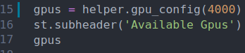
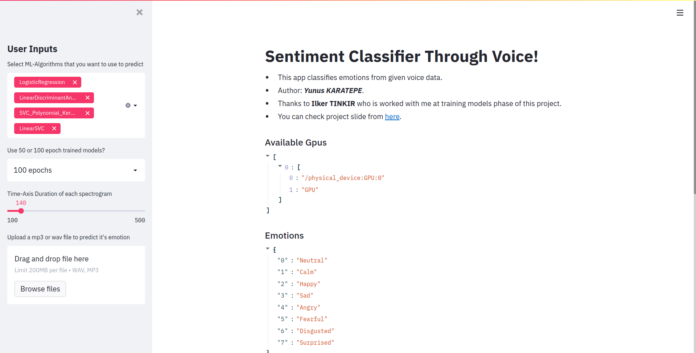
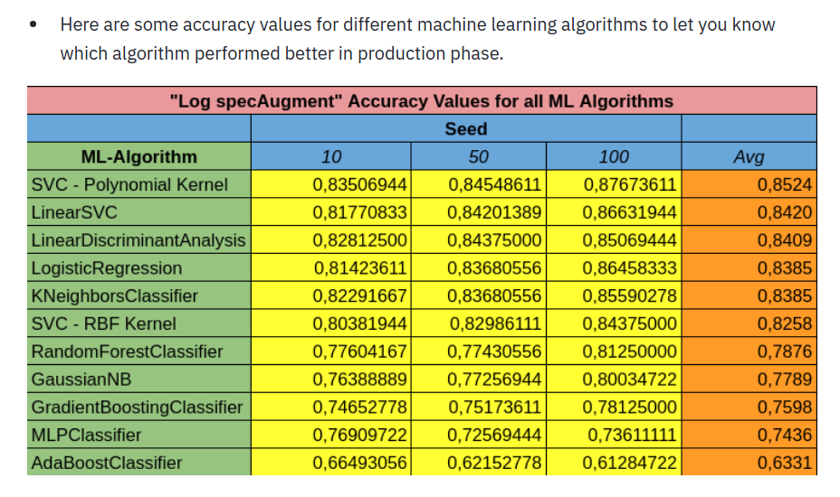
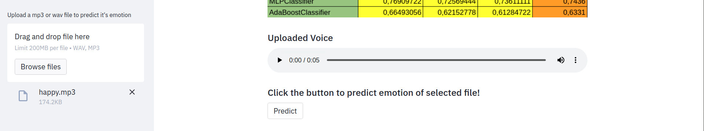
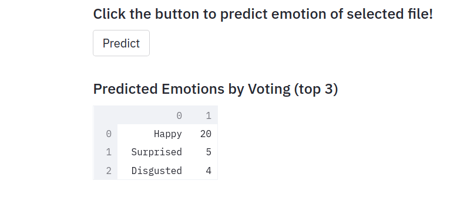

# Emotion Classification With Voice Using CNN, ML in Python

* This application tries to predict the emotion of a person with given voice data.
* Basically uses CNN models and ML-Models which are trained with [RAVDESS Dataset](https://www.kaggle.com/uwrfkaggler/ravdess-emotional-speech-audio).
* Training these CNNs and ML-Models was actually my final project and it was a team work. At training phase I worked with Ilker Tınkır and I really appreciate his help.
* You can find more information about this project in this [slide](https://docs.google.com/presentation/d/1UGMgex6G5fAtTqPs33SiFulAznYufKwQ/edit?usp=sharing&ouid=118405775020092724633&rtpof=true&sd=true).
* Give it a shot! Maybe it finds your deep sadness hidden in your laugh :stuck_out_tongue_closed_eyes:

### How to run?
* Download or Clone this repository to your computer.
* For running on windows, first go to this [link](https://drive.google.com/file/d/1JEr5Gxnl_7n_B3g11JPEvfni6k8uvZte/view?usp=sharing), download the rar file and extract it into the directory of ***app.py***. These files are ffmpeg files which we are using these with pydub library to convert .mp3 files to .wav files. All 3 .exe files must be in the same directory with ***app.py***
* Go into ***requirements.txt*** and install all the libraries listed there.
* If you don't have tensorflow gpu installed and get error about tensorflow gpu, go into ***app.py*** and delete these 3 lines of code 
* 
* All the trained CNN and ML models are inside of ***models*** directory. (If you want to check them out)
* Open command line in this directory and type: **streamlit run app.py**
* Then you should have application opened on your favorite web browser :sunglasses:

### Making predictions

* This is the interface of the application.

* You can add ML-Models which votes to predict an emotion or remove any of them. There are total 11 trained ML-Models.

* If you scroll down you will see a table which contains success of each ML-Model at testing phase of this project.

* I actually saved models at 50. epoch and 100. epoch, it turns out sometimes 50 epochs trained models performs better but in general i perefer you to go with 100 epochs trained ones.
* And the last parameter is Time-Axis duration of spectrograms. 100 and 500 are bounds but they actually don't mean that much as numbers. All you need to know if you go with 100 there will be a lot of spectrograms and each time axis of each spectrogram will be short. If you go 500 your time axis will be too long and details may disappear. This may lead prediction to take too much time (Ofc. it's directly proportional to your voice data duration). Training data voices were around **140** so again ***I prefer*** you to go with **140-150**.
* Then select your voice that you want to predict emotions. There are example data in **audios** folder. Check these out if you will.
* After you select your voice from your computer to predict, you can listen it from app and also predict button will be shown.

* Click the predict button and it make take some time which is actually directly proportional to selected ML-Model count and created spectrogram count. If you have tensorflow-gpu it will take less ofc.
* And there you have it! You can see at upper image I gave happy.mp3 as input and from the image below, I got 20 happy vote from CNN, Logistic Regression, SVC Polynomial Kernel and Linear SVC.

* Have fun with it! :yum:

